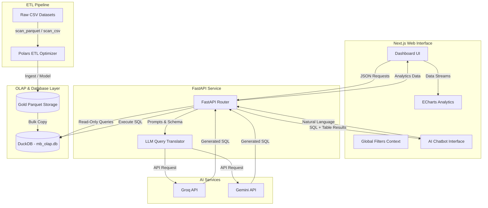
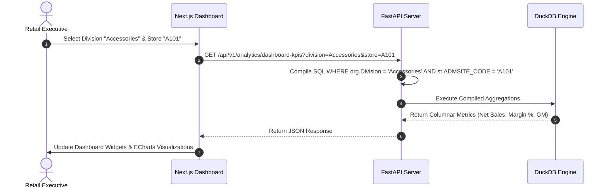

# MB OLAP - Retail BI Engine

MB OLAP is a high-performance Enterprise Retail BI & OLAP analytics engine. It enables retail executives and business analysts to load vast transaction datasets, execute sub-second aggregate OLAP queries, run inventory/sales forecasting models, and interface with data using a Natural Language (AI-powered) Chat interface.

---

## 🏗️ System Architecture

The application is split into a **Modern Web Frontend** (Next.js), a **Columnar Analytical Server** (FastAPI), and an **In-Memory/On-Disk Data Pipeline** (Polars + DuckDB).



---

## ⚙️ How It Works (Detailed)

### 1. Data Ingestion & ETL Pipeline
1. **Raw Ingestion:** Reads raw data files from `dataset/` using memory-efficient lazy evaluation (`pl.scan_csv`/`pl.scan_parquet`).
2. **Deduplication & Cleaning:**
   * Normalizes casing, trims whitespace, and replaces nulls with appropriate fallbacks (`UNKNOWN` for strings, `0.0` for floats).
   * Parses multiple variable date formats into uniform ISO-8601 datetimes.
   * Deduplicates store items on `ICODE` keeping only the latest records.
3. **Database Loading:** Writes output directly to Gold Parquet files. DuckDB then bulk-imports the Parquet data directly using its vectorized execution engine into `storage/db/mb_olap.db` creating optimized indexes on dimensions (Date, Supplier, Product, Organization).

### 2. Analytical Web Service (FastAPI)
The server exposes endpoints for executive KPIs, sales charts, forecasts, and supplier insights:
* **Vectorized Execution:** Uses DuckDB to run columnar database aggregations over millions of rows in milliseconds.
* **Filter Context Builder:** Dynamically compiles complex SQL `WHERE` clauses from front-end multi-select choices.



### 3. Natural Language AI Chat (Text-to-SQL)
1. The user asks a question in plain English (e.g., *"Which is the best-selling product in Accessories 1?"*).
2. The server extracts potential entities (brands, categories, sites) to match against catalog dimensions.
3. The server constructs a prompt combining the DB Schema (DDL), sample datasets, matching entities, and the user query.
4. Groq / Gemini API translates the question into a valid, sandboxed, read-only SQL query.
5. The server runs the SQL query against DuckDB and returns the query result along with raw data table formatted dynamically for display.

---

## ⚡ Scalability & Optimization

Designed from the ground up for high throughput and massive datasets:

### Data Engineering Level
* **Polars Lazy Evaluation:** Unlike Pandas, Polars constructs a query optimization graph and streams data in chunks without loading entire files into memory.
* **Thread Bounding:** Pipeline thread limits are capped (`POLARS_MAX_THREADS = 2`) to ensure that ETL jobs run safely on limited hardware (such as free-tier cloud instances) without crashing from Out-of-Memory (OOM) errors.

### Database Level
* **Columnar Storage:** DuckDB is an OLAP-first database. Because it stores data column-by-column rather than row-by-row, it only reads relevant metric columns (e.g., `NET_SALE_AMOUNT`) from disk during aggregations, reducing I/O bottleneck by up to **90%**.
* **Zero-Copy Parquet Integration:** DuckDB queries Parquet files directly, eliminating database write bottlenecks during rapid test deployments.

### API & Frontend Level
* **Static Page Prerendering:** Next.js uses Static Generation (SSG) for pages and components, delivering fast initial loads via global CDNs.
* **Decoupled Deployment Architecture:**
  * **Next.js Frontend:** Hosted on **Vercel** edge servers (scales instantly, zero-cost serverless execution).
  * **FastAPI Backend:** Hosted on **Render** or similar PaaS, separating computation and memory workloads from web page serving.

---

## 🛠️ Local Development Setup

### 1. Backend Setup (FastAPI)
```bash
# Set up virtual environment
python -m venv .venv
source .venv/bin/activate  # or .venv\Scripts\activate on Windows

# Install dependencies
pip install -r requirements.txt

# Run the ingestion & modeling pipeline (if DB needs rebuilding)
python scripts/ingest_data.py
python scripts/clean_and_model.py

# Start the web server
python -m uvicorn scripts.server:app --reload --port 8000
```

### 2. Frontend Setup (Next.js)
```bash
# Install packages
npm install

# Start development server
npm run dev
```
Open [http://localhost:3000](http://localhost:3000) to view the application dashboard.
